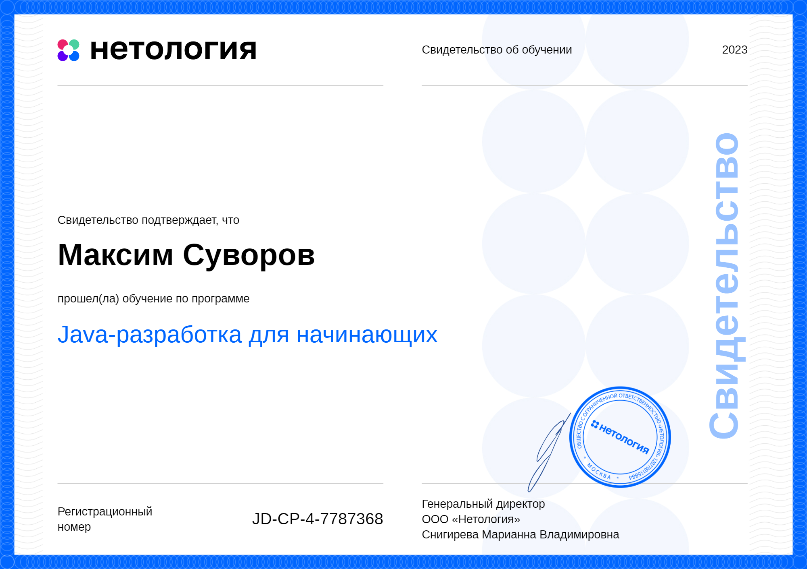

##   👋Welcome to my GitHub repositories.
### My name is Maxim Suvorov. I am a Java developer.

### My pet-projects
* [Finance Manager](https://github.com/max10max/PersonalFinanceManager)
* [Task Manager](https://github.com/max10max/Coursework-TODOs)
* [Search Engine](https://github.com/max10max/SearchEngine-diplom)

  
 Diploma of learning Java 

### My contacts:
* Telegram:  [https://t.me/s_max_s](https://t.me/s_max_s)
* email: <a href="mailto:suvormaks@yandex.ru">suvormaks@yandex.ru</a>

<!--
**max10max/max10max** is a ✨ _special_ ✨ repository because its `README.md` (this file) appears on your GitHub profile.

Here are some ideas to get you started:

- 🔭 I’m currently working on ...
- 🌱 I’m currently learning ...
- 👯 I’m looking to collaborate on ...
- 🤔 I’m looking for help with ...
- 💬 Ask me about ...
- 📫 How to reach me: ...
- 😄 Pronouns: ...
- ⚡ Fun fact: ...
-->
